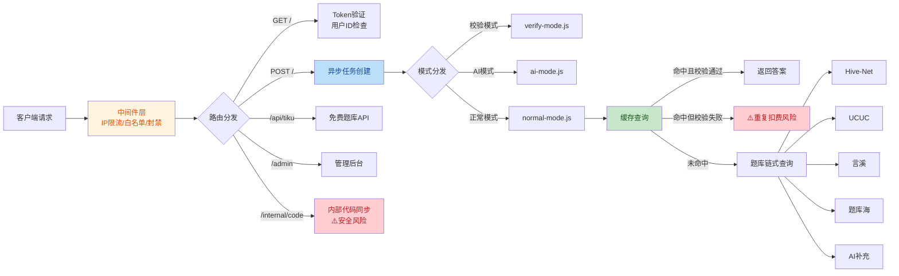
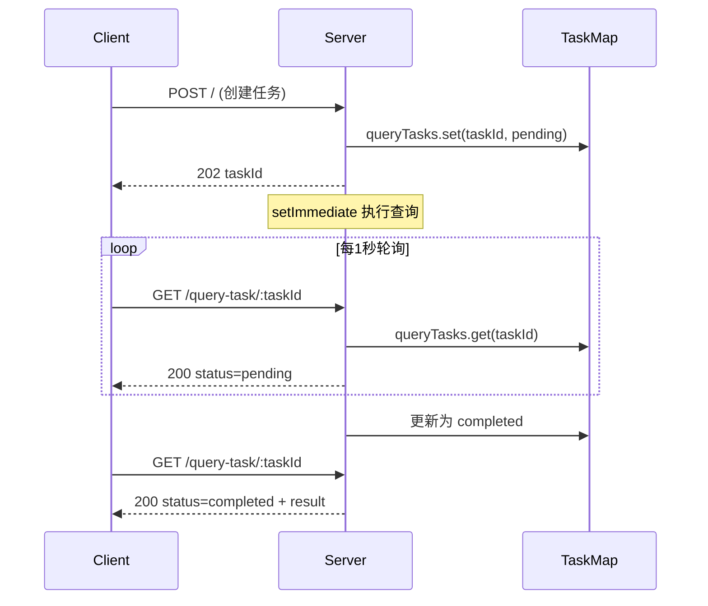

# 代码审计报告 - tiku/src

> **审计日期**: 2026-06-25
> **审计范围**: `f:\Users\PIAOPIAO\CodeBuddy\20260309\tiku\src` 目录下全部源代码
> **审计标准**: 行业通用代码质量规范（可维护性、健壮性、安全性、一致性）
> **审计人**: 自动化代码审查（GLM-5.2 + DeepSeek-V4 联合审查合并）

---

## 目录

- [1. 审计概览](#1-审计概览)
- [2. 严重问题 (Critical)](#2-严重问题-critical)
- [3. 主要问题 (Major)](#3-主要问题-major)
- [4. 次要问题 (Minor)](#4-次要问题-minor)
- [5. 安全性问题 (Security)](#5-安全性问题-security)
- [6. 性能问题 (Performance)](#6-性能问题-performance)
- [7. 重复代码块](#7-重复代码块)
- [8. 流程逻辑设计缺陷](#8-流程逻辑设计缺陷)
- [9. 代码质量问题 (Code Quality)](#9-代码质量问题-code-quality)
- [10. 改进建议汇总](#10-改进建议汇总)

---

## 1. 审计概览

### 1.1 项目结构

```
tiku/src/
├── admin/          # 管理后台（路由、会话、面板、登录）
├── config/         # 配置（应用、数据库、AI模型、初始化）
├── modes/          # 查询模式（AI模式、正常模式、校验模式）
├── tiku/           # 题库集成（API、缓存、辅助、提示词、统计）
├── routes.js       # 主路由（核心业务入口）
├── auth.js         # 认证与Token管理
├── ip-security.js  # IP安全与限流
├── mode-handler.js # 模式分发
├── query-tasks.js  # 异步任务管理
├── recheck.js      # 答案重查机制
├── remote-scripts.js # 远程脚本下发
├── tavily-search.js  # 联网搜索集成
├── utils.js        # 工具函数
└── config.js / tiku.js  # 聚合导出
```

### 1.2 问题统计

| 严重级别 | 数量 | 说明 |
|---------|------|------|
| Critical | 5 | 会导致运行时崩溃、严重安全漏洞或错误扣费 |
| Major | 16 | 逻辑缺陷、竞态条件、设计不合理 |
| Minor | 10 | 代码质量、可维护性问题 |
| Security | 3 | 安全漏洞与风险 |
| Performance | 3 | 性能瓶颈与资源泄漏风险 |
| 重复代码 | 9 | 跨文件重复逻辑 |
| 流程设计缺陷 | 5 | 流程逻辑设计不合理 |
| 代码质量 | 4 | 编码规范与架构问题 |
| **合计** | **55** | |

### 1.3 架构流程图



---

## 2. 严重问题 (Critical)

### C-01: `remainingCount` 变量在声明前使用（TDZ 错误）

- **文件**: [modes/ai-mode.js](file:///f:/Users/PIAOPIAO/CodeBuddy/20260309/tiku/src/modes/ai-mode.js#L362-L371)
- **问题描述**: 在 `handleAIMode` 函数中，图片URL检查逻辑（第362-369行）使用了 `remainingCount` 变量，但该变量在第371行才通过 `let remainingCount = 999999;` 声明。JavaScript 的 `let` 声明存在"暂时性死区"（Temporal Dead Zone, TDZ），在声明前访问会抛出 `ReferenceError`。

```javascript
// 第362-369行：使用 remainingCount（尚未声明）
if (imageUrls && imageUrls.length > 0 && !modelConfig.supportsVision) {
    return c.json({
      code: 400,
      msg: "该模型不支持图片输入，请切换模型或者模式",
      data: { answer: [], num: remainingCount }  // ← TDZ 错误
    }, 400);
  }

  let answerData;
  let remainingCount = 999999;  // 第371行才声明
```

- **影响**: 当用户提交包含图片的题目，且当前AI模型不支持视觉时，服务端会抛出未捕获异常，导致请求返回500错误。
- **修复建议**: 将 `let remainingCount = 999999;` 和 `let answerData;` 的声明移到图片URL检查之前。

---

### C-02: 答案正确性上报可被恶意利用篡改判断题答案

- **文件**: [tiku/cache.js](file:///f:/Users/PIAOPIAO/CodeBuddy/20260309/tiku/src/tiku/cache.js#L155-L180)
- **问题描述**: `applyCorrectnessUpdate` 函数在收到判断题（type='3'）的"错误"上报（isCorrect=0）时，会直接反转缓存中的答案并标记为 `is_correct=1`（已验证正确）。该机制仅依赖单次上报即生效，缺乏交叉验证。

```javascript
// 第155-170行：判断题错误上报直接反转答案
if (type === '3' && isCorrect === 0) {
  const reversedAnswer = reverseJudgeAnswer(judgeAnswer);
  if (reversedAnswer) {
    await db.prepare(
      "UPDATE answer_cache SET answer = ?, is_correct = 1 WHERE question_hash = ?"
    ).run(JSON.stringify([reversedAnswer]), questionHash);
    return true;
  }
}
```

- **影响**: 攻击者可通过批量上报"错误"，将正确的判断题答案系统性反转，污染题库缓存。虽然代码有 `wasRecentlyQueried` 检查，但该检查基于内存Map，服务重启后即失效。
- **修复建议**: 
  1. 增加多用户交叉验证机制（至少2个独立用户上报才生效）
  2. 对上报者进行信誉评分，低信誉用户上报不立即生效
  3. 判断题反转操作应记录审计日志并支持回滚

---

### C-03: `setImmediate` 中使用已过期的 Hono Context

- **文件**: [routes.js](file:///f:/Users/PIAOPIAO/CodeBuddy/20260309/tiku/src/routes.js#L958-L1010)
- **问题描述**: POST `/` 路由在创建异步任务后，通过 `setImmediate` 在事件循环下一个Tick执行查询逻辑。但此时HTTP响应（202 Accepted）已经返回给客户端，传入 `handleQuery(c, ...)` 的 Hono Context `c` 已不再有效。`handleQuery` 内部调用 `c.json()` 构造响应，但该响应只能通过 `response.clone()` 解析后存入 `queryTasks`，而非真正发送给客户端。

```javascript
// 第958行：setImmediate 中使用 c
setImmediate(async () => {
  // ...
  const response = await handleQuery(c, {  // c 已失效
    // ...
  });
  
  let resultData;
  try {
    const clonedResponse = response.clone();
    resultData = await clonedResponse.json();  // 解析响应存入任务
  } catch (e) {
    // ...
  }
});
```

- **影响**: 
  1. 如果 `handleQuery` 内部依赖 Context 的请求头或状态，可能获取到异常数据
  2. `response.clone()` 在某些边缘情况下可能失败
  3. 异步任务中的异常虽然被捕获，但错误信息可能不完整
- **修复建议**: 重构 `handleQuery` 使其返回纯数据对象而非 Hono Response，由调用方决定如何包装响应。

---

### C-04: `/internal/code` 接口暴露完整源代码和 `.env` 文件

- **文件**: [routes.js](file:///f:/Users/PIAOPIAO/CodeBuddy/20260309/tiku/src/routes.js#L159-L226)
- **问题描述**: `/internal/code` 路由在验证 `INTERNAL_API_KEY` 后，会读取并返回所有源代码文件（包括 `routes.js`、`auth.js`、`config/`、`modes/`、`tiku/`、`admin/` 下全部 .js 文件）以及 **`.env` 文件完整内容**。`.env` 文件包含所有第三方API密钥（TOKENHUB_API_KEY、DEEPSEEK_API_KEY、302AI_API_KEY、TAVILY_KEYS、数据库密码等）。

```javascript
// 第159-226行：返回所有源代码和.env
app.get('/internal/code', async (c) => {
  // ... 仅校验 INTERNAL_API_KEY
  const files = {};
  // 读取所有 .js 源文件
  for (const file of codeFiles) { files[file] = fs.readFileSync(...); }
  // 读取 .env
  const envPath = path.join(srcDir, '..', '.env');
  if (fs.existsSync(envPath)) {
    envFile = fs.readFileSync(envPath, 'utf-8');  // ← 暴露所有密钥
  }
  return c.json({ code: 200, data: { files, envFile } });
});
```

- **影响**: 若 `INTERNAL_API_KEY` 泄露（如通过日志、配置文件、源码仓库），攻击者可获取完整服务器代码和所有API密钥，导致全系统沦陷。
- **修复建议**: 
  1. **禁止通过HTTP接口返回 `.env` 文件内容**
  2. 对内部接口增加 IP 白名单限制
  3. 使用更强的认证机制（如 mTLS 双向证书认证）
  4. 对返回的源代码进行脱敏处理

---

### C-05: 缓存答案校验失败后不退费，导致用户被重复扣费

- **文件**: [modes/normal-mode.js](file:///f:/Users/PIAOPIAO/CodeBuddy/20260309/tiku/src/modes/normal-mode.js#L271-L334)
- **问题描述**: 正常模式中，缓存命中时先扣除 0.8 次（第286-292行），然后进行缓存答案校验（第305行）。如果校验失败（`cacheValidation.valid === false`），代码仅打印日志"跳过缓存继续查询"（第307行），**不退还已扣的 0.8 次**，随后进入正常查询流程再扣 1 次。用户因缓存脏数据被多扣 1.8 次。

```javascript
// 第286-292行：先扣费 0.8 次
const cacheCost = 0.8;
const decrementResult = await decrementCount(token, userId, skipUserIdCheck, cacheCost);
// ...

// 第305-307行：校验失败不退费，继续查询
const cacheValidation = validateAndCleanAnswer(questionData.type, cachedAnswerArr, questionData.options);
if (!cacheValidation.valid) {
  log(`[X] 缓存答案校验失败: ${cacheValidation.reason}，跳过缓存继续查询`);
  // ← 缺少退费逻辑！
}
// 后续正常查询再扣 1 次
```

- **影响**: 缓存中存在脏数据时，用户每次查询被多扣 0.8 次，直接影响用户权益。
- **修复建议**: 
  1. 校验失败时立即退还已扣的 0.8 次
  2. 或改为"先校验后扣费"模式，确认缓存答案有效后再扣费
  3. 同时清理校验失败的脏缓存数据

---

## 3. 主要问题 (Major)

### M-01: IP限流使用单一共享窗口，多端点限流相互干扰

- **文件**: [ip-security.js](file:///f:/Users/PIAOPIAO/CodeBuddy/20260309/tiku/src/ip-security.js#L226-L260)
- **问题描述**: `checkRateLimit` 函数为每个IP维护单一滑动窗口数组，但不同端点传入不同 `limit` 参数（POST `/` 为100，`/query-task/` 为30，其他为20）。由于所有请求共享同一窗口，低限流端点的请求会被高限流端点的请求"淹没"。

```javascript
// 第226-260行：单一窗口，多端点共享
function checkRateLimit(ip, limit = 10) {
  let requests = ipRequestCache.get(ip);
  // ...
  if (requests.length >= limit) {  // limit 随调用方变化
    return { allowed: false, count: requests.length };
  }
  requests.push(now);
  return { allowed: true, count: requests.length };
}
```

- **影响**: 用户正常使用POST `/`（限流100）时，如果同时轮询 `/query-task/`（限流30），可能因窗口已积累超过30个请求而被错误限流。
- **修复建议**: 按端点维度分别维护滑动窗口，或采用令牌桶算法。

---

### M-02: `verifyUserFid` 在 fid 未提供时拒绝合法用户

- **文件**: [routes.js](file:///f:/Users/PIAOPIAO/CodeBuddy/20260309/tiku/src/routes.js#L744-L751) 与 [auth.js](file:///f:/Users/PIAOPIAO/CodeBuddy/20260309/tiku/src/auth.js#L46-L52)
- **问题描述**: GET `/` 路由中，当用户存在且有有效Token时，代码无条件调用 `verifyUserFid(userId, fid)`。但 `verifyUserFid` 在 `!userId || !fid` 时返回 `false`，导致未提供 fid 的用户被错误拒绝。

```javascript
// routes.js 第744行：无条件调用 fid 验证
const fidMatch = await verifyUserFid(userId, fid);
if (!fidMatch) {
  return c.json({ code: 403, msg: '身份验证失败...' }, 403);
}

// auth.js 第46-52行：fid 为空时返回 false
async function verifyUserFid(userId, fid) {
  if (!userId || !fid) return false;  // ← 未提供 fid 直接拒绝
  // ...
}
```

- **影响**: 如果客户端版本较旧不发送 fid，或某些场景下 fid 不可用，已注册用户无法获取Token列表。
- **修复建议**: 当 `fid` 未提供时，应跳过 fid 验证（向后兼容），或仅在用户已绑定 fid 时才要求验证。

---

### M-03: `lockToken` 并发锁定同一Token时锁记录被覆盖

- **文件**: [auth.js](file:///f:/Users/PIAOPIAO/CodeBuddy/20260309/tiku/src/auth.js#L503-L545)
- **问题描述**: `lockedTokens` Map 以 token 为键存储锁定信息，当同一Token并发发起两个AI请求时，第二次 `lockToken` 会覆盖第一次的锁记录。虽然数据库层面的原子扣减是正确的，但 `lockedTokens` 状态不一致会影响调试和潜在的结算逻辑。

```javascript
// 第541行：覆盖式写入，不检查已有锁
lockedTokens.set(token, { lockedAt: Date.now(), lockCount });
```

- **影响**: 
  1. `settleToken` 中的 `lockedTokens.delete(token)` 会删除整个锁记录，可能影响后续结算
  2. 无法检测同一Token的并发锁定情况
- **修复建议**: 改用引用计数（`lockCount` 累加）或为每次锁定生成唯一ID。

---

### M-04: 异步任务无持久化，服务重启丢失全部进行中任务

- **文件**: [routes.js](file:///f:/Users/PIAOPIAO/CodeBuddy/20260309/tiku/src/routes.js#L952-L1010) 与 [query-tasks.js](file:///f:/Users/PIAOPIAO/CodeBuddy/20260309/tiku/src/query-tasks.js#L1-L20)
- **问题描述**: `queryTasks` 使用内存 Map 存储任务状态，服务重启或崩溃时所有进行中的任务（status='pending'/'processing'）会丢失，客户端轮询时收到404。

```javascript
// query-tasks.js 第1行：内存存储
const queryTasks = new Map();
```

- **影响**: 服务重启期间，已接受但未完成的查询请求会静默失败，用户体验差。
- **修复建议**: 
  1. 将任务状态持久化到数据库或Redis
  2. 启动时恢复未完成任务或主动通知客户端任务失败

---

### M-05: `createTokenForNewUser` 硬编码初始次数与卡类型不一致

- **文件**: [auth.js](file:///f:/Users/PIAOPIAO/CodeBuddy/20260309/tiku/src/auth.js#L215-L225)
- **问题描述**: 新用户Token通过 `generateValidToken(masterSecret)` 生成（使用默认500次卡密钥），但插入数据库时硬编码 `remaining_count: 40`，与卡类型声明的500次不一致。

```javascript
// 第220行：硬编码40次
await db.prepare(
  "INSERT INTO tokens (token, user_id, remaining_count, ...) VALUES (?, ?, 40, ...)"
).run(newToken, userId, ...);
```

- **影响**: 新用户获得的Token实际只有40次额度，但 `verifyUserToken` 验证时认为这是500次卡，造成业务逻辑矛盾。
- **修复建议**: 使用 `INITIAL_COUNT` 常量或从卡类型配置中读取初始次数。

---

### M-06: 数据库连接池配置过大（400连接）

- **文件**: [config/db-config.js](file:///f:/Users/PIAOPIAO/CodeBuddy/20260309/tiku/src/config/db-config.js#L7-L18)
- **问题描述**: `connectionLimit: 400` 对单实例MySQL而言过高，可能导致数据库连接数耗尽，影响其他服务。

```javascript
const DB_CONFIG = {
  // ...
  connectionLimit: 400,  // ← 过高
  queueLimit: 0,         // ← 无限排队
  // ...
};
```

- **影响**: 高并发场景下可能耗尽数据库最大连接数（默认151），导致连接失败。
- **修复建议**: 根据实际负载调整为50-100，并设置合理的 `queueLimit`。

---

### M-07: `getIpLocation` 在请求热路径中同步调用外部API

- **文件**: [ip-security.js](file:///f:/Users/PIAOPIAO/CodeBuddy/20260309/tiku/src/ip-security.js#L100-L125) 与 [ip-security.js](file:///f:/Users/PIAOPIAO/CodeBuddy/20260309/tiku/src/ip-security.js#L195-L215)
- **问题描述**: `logIpAccess` 在新IP首次访问时调用 `getIpLocation`，该函数同步请求 `ip9.com.cn` 外部API（3秒超时）。虽然 `logIpAccess` 本身是异步的且用 `.catch()` 忽略错误，但 `getIpLocation` 仍会占用事件循环。

```javascript
// 第195-215行：新IP插入时同步查询归属地
async function logIpAccess(ip, endpoint, userAgent, isSuspicious = false) {
  // ...
  if (!existing) {
    const location = await getIpLocation(ip);  // ← 阻塞3秒
    // ...
  }
}
```

- **影响**: 大量新IP同时访问时，会产生多个并发的 `getIpLocation` 调用，消耗网络资源和连接。
- **修复建议**: 
  1. 将IP归属地查询改为后台队列异步处理
  2. 增加IP归属地本地缓存表，避免重复查询

---

### M-08: `processReferral` 随机奖励机制可被利用

- **文件**: [auth.js](file:///f:/Users/PIAOPIAO/CodeBuddy/20260309/tiku/src/auth.js#L290-L310)
- **问题描述**: 推荐奖励使用 `randomInt(20, 100)` 和 `randomInt(20, 50)` 随机生成，使用 `Math.random()` 非加密安全随机数。攻击者可通过批量注册新用户并尝试推荐，利用随机性获得高奖励。

```javascript
// 第300-303行：非加密随机
const REFERRER_REWARD = randomInt(20, 100);
const REFEREE_REWARD = randomInt(20, 50);
console.log(`推荐奖励随机：推荐人+${REFERRER_REWARD}次，被推荐人+${REFEREE_REWARD}次`);
```

- **影响**: 奖励金额不可预测，用户体验不一致；且随机范围过大，难以控制成本。
- **修复建议**: 
  1. 固定奖励金额或缩小随机范围
  2. 增加推荐频率限制（同一推荐人每日限N次）

---

### M-09: `db.prepare()` 每次调用都创建新对象，无语句复用

- **文件**: [config/db-config.js](file:///f:/Users/PIAOPIAO/CodeBuddy/20260309/tiku/src/config/db-config.js#L33-L50)
- **问题描述**: `db.prepare(sql)` 每次返回一个包含 `all/get/run` 方法的新对象，这些方法内部调用 `pool.query` 或 `pool.execute`。MySQL 的 `execute` 会进行预编译，但每次 `prepare` 都创建新闭包，无法复用预编译语句。

```javascript
prepare(sql) {
    return {
      async all(...params) {
        const [rows] = await pool.query(sql, params);  // 每次新查询
        return rows;
      },
      // ...
    };
  }
```

- **影响**: 频繁调用相同SQL时无法利用预编译语句缓存，性能略低。
- **修复建议**: 缓存常用SQL的预编译语句，或直接使用 `pool.execute`。

---

### M-10: `switchToNextAvailableKey` 索引偏移错误（off-by-one）

- **文件**: [tavily-search.js](file:///f:/Users/PIAOPIAO/CodeBuddy/20260309/tiku/src/tavily-search.js#L65-L95)
- **问题描述**: `switchToNextAvailableKey(currentKeyIndex)` 中 `currentKeyIndex` 是 **1-based** 索引（`markKeyAsInvalid` 验证 `keyIndex > 0 && keyIndex <= TAVILY_KEY_COUNT`，UPDATE 语句使用 `i + 1`），但循环 `for (let i = currentKeyIndex; i < TAVILY_KEY_COUNT; i++)` 将其直接用作 **0-based** 数组下标。当 `currentKeyIndex=1` 时，循环从 `i=1` 开始，跳过了 `TAVILY_KEYS[0]`（第一个密钥）。

```javascript
// 第70行：1-based 索引直接用作 0-based 数组下标
for (let i = currentKeyIndex; i < TAVILY_KEY_COUNT; i++) {
  // ...
  const key = TAVILY_KEYS[i];  // ← currentKeyIndex=1 时跳过 TAVILY_KEYS[0]
  // ...
  await db.prepare("UPDATE global_stats SET tavily_current_key = ? WHERE id = 1").run(i + 1);  // ← 确认1-based
}
```

- **影响**: 密钥切换时第一个密钥永远被跳过，且当 `currentKeyIndex = TAVILY_KEY_COUNT` 时 `TAVILY_KEYS[i]` 越界返回 `undefined`。
- **修复建议**: 统一索引基准，将循环改为 `for (let i = currentKeyIndex - 1; i < TAVILY_KEY_COUNT; i++)` 或全程使用 0-based。

---

### M-11: `decrementCount` 的 `checkOnly` 模式不检查 `is_blacklisted`

- **文件**: [auth.js](file:///f:/Users/PIAOPIAO/CodeBuddy/20260309/tiku/src/auth.js#L413-L442)
- **问题描述**: `decrementCount` 函数在 `checkOnly=true` 模式下，SELECT 语句仅查询 `remaining_count, is_free_token, user_id`（第418行），**不查询 `is_blacklisted`**，且 checkOnly 返回路径（第438行）不检查黑名单状态。已被拉黑的 Token 在 checkOnly 模式下会返回 `success: true`。

```javascript
// 第418行：SELECT 未包含 is_blacklisted
const record = await db.prepare("SELECT remaining_count, is_free_token, user_id FROM tokens WHERE token = ?").get(token);

// 第438行：checkOnly 直接返回，不检查黑名单
if (checkOnly) {
  return { success: true, remainingCount: record.remaining_count };
}
```

- **影响**: 校验模式入口处的余额检查（verify-mode.js 第467行）使用 `checkOnly=true`，可能导致已被拉黑的 Token 通过余额检查，进入后续扣费流程才发现被拉黑。
- **修复建议**: 在 SELECT 中加入 `is_blacklisted` 字段，并在 checkOnly 模式下也检查黑名单状态。

---

### M-12: 校验模式两步请求扣费逻辑导致费用统计不准确

- **文件**: [modes/verify-mode.js](file:///f:/Users/PIAOPIAO/CodeBuddy/20260309/tiku/src/modes/verify-mode.js#L458-L925)
- **问题描述**: 校验模式设计为两步请求：第一步 `checkOnly=true` 返回202，第二步 `checkOnly=false` 执行深度思考。在第二步中（第892-925行），代码重新计算了第一轮费用 `step1Cost`（第900行），然后 `totalCost = step1Cost + step2Cost`（第912行）返回给客户端。但第一轮费用在第一次请求时已经单独扣除并返回过。

```javascript
// 第900-912行：第二轮请求中重新计算并累加第一轮费用
const step1Cost = ...;  // 第一轮费用（已在第一次请求中扣除）
const step2Cost = ...;  // 第二轮费用
const totalCost = step1Cost + step2Cost;  // ← 返回给客户端的是总和
```

- **影响**: 客户端显示的消耗次数不准确，用户困惑为什么第二轮请求显示的费用包含了第一轮的费用。
- **修复建议**: 明确区分"本轮实际扣费"和"累计总费用"，在第二轮请求中只返回第二轮的消耗 `cost`，可额外提供 `totalCost` 字段供参考。

---

### M-13: `saveAnswerToCache` 的 `ON DUPLICATE KEY UPDATE` 覆盖 `is_correct` 状态

- **文件**: [tiku/cache.js](file:///f:/Users/PIAOPIAO/CodeBuddy/20260309/tiku/src/tiku/cache.js#L106-L108)
- **问题描述**: `INSERT ... ON DUPLICATE KEY UPDATE` 语句中，`is_correct` 被设置为传入的 `isCorrectValue`。当调用方未传入 `isCorrect` 参数时，`isCorrectValue = null`，会覆盖数据库中已有的 `is_correct=1`（已验证正确）状态。

```javascript
// 第105-108行：isCorrectValue 为 null 时覆盖已有状态
const isCorrectValue = isCorrect !== null ? isCorrect : null;
await db.prepare(
  "INSERT INTO answer_cache (...) VALUES (...) ON DUPLICATE KEY UPDATE ..., is_correct=?"
).run(..., isCorrectValue, ...);
```

- **影响**: 当缓存已存在且 `is_correct=1`（已验证正确），但新调用 `saveAnswerToCache` 时未传入 `isCorrect`，会导致 `is_correct` 被重置为 NULL，丢失已验证状态。
- **修复建议**: 在 UPDATE 子句中使用 `COALESCE(?, is_correct)` 或条件判断，仅当传入值非 NULL 时才更新 `is_correct`。

---

### M-14: `fetchAnswer` 中 `incrementTotalQueries` 可能被调用两次

- **文件**: [tiku/api.js](file:///f:/Users/PIAOPIAO/CodeBuddy/20260309/tiku/src/tiku/api.js#L407-L459)
- **问题描述**: 在 `fetchAnswer` 函数中，当API调用成功时 `incrementTotalQueries('tiku')` 在第407行被调用；当API调用失败但非次数耗尽时，同一函数在第459行也被调用。如果第一次调用失败但非次数耗尽，重试后第二次调用成功，则总查询计数被增加两次。

```javascript
// 第407行：成功时计数
await incrementTotalQueries('tiku');

// 第459行（推测）：失败但非次数耗尽时也计数
await incrementTotalQueries('tiku');
```

- **影响**: 统计数据不准确，总查询次数可能高于实际查询次数。
- **修复建议**: 确保每次 `fetchAnswer` 调用只增加一次总查询计数，将计数移到函数入口处或使用标志位控制。

---

### M-15: 排序题（type=13）答案从不缓存，每次都需调用AI

- **文件**: [modes/normal-mode.js](file:///f:/Users/PIAOPIAO/CodeBuddy/20260309/tiku/src/modes/normal-mode.js#L339-L433)
- **问题描述**: 排序题分支（第339行）中明确注释"排序题答案不保存缓存"（第352行），导致排序题即使之前已查询过，也无法命中缓存，每次都需要调用AI补充。

```javascript
// 第339行：排序题直接跳过题库
if (questionData.type === "13") {
  log("[SKIP] 排序题直接使用AI补充（跳过题库）");
  // ...
  // 第352行：不缓存
  log("[WARN] 排序题答案不保存缓存");
  // ...
}
```

- **影响**: 排序题查询成本高（每次都调AI），且相同排序题重复查询浪费资源。
- **修复建议**: 评估排序题答案的可缓存性，如果AI返回的排序答案可靠，应保存到缓存。如担心准确性，可标记为 `is_correct=0` 待验证。

---

### M-16: `releaseToken` 异常释放不退费，用户因系统错误损失次数

- **文件**: [auth.js](file:///f:/Users/PIAOPIAO/CodeBuddy/20260309/tiku/src/auth.js#L630-L635)
- **问题描述**: `releaseToken` 函数在异常时调用，注释说明"不返还次数，锁定时的扣减保留"。这意味着如果AI调用因网络超时、API服务端错误等不可控因素失败，用户将损失预锁定的全部次数（可能高达20次）。

```javascript
// 第630-635行：异常释放不退费
async function releaseToken(token, lockCount) {
  if (!token) return;
  lockedTokens.delete(token);
  // 不返还次数，锁定时的扣减保留（异常时用户损失锁定次数，防止恶意利用异常逃费）
  console.log(`[预锁定] Token ${token.substring(0, 8)}*** 异常释放，${lockCount}次已扣`);
}
```

- **影响**: 用户可能因网络问题或系统故障损失大量次数，体验较差。虽然注释说明是"防止恶意利用异常逃费"，但一刀切策略对正常用户不公平。
- **修复建议**: 区分"用户主动取消"和"系统异常"，对系统异常（如API超时、网络错误、5xx响应）应退还预锁定次数；对用户主动中断可保留扣减。

---

## 4. 次要问题 (Minor)

### m-01: 使用 `async` 作为对象属性名（保留字）

- **文件**: [routes.js](file:///f:/Users/PIAOPIAO/CodeBuddy/20260309/tiku/src/routes.js#L938)
- **问题描述**: `const { async: supportAsync } = body;` 使用 `async` 作为解构属性名。虽然 ES2015+ 允许保留字作为属性名，但代码可读性差，且某些旧版工具链可能解析失败。

```javascript
const { async: supportAsync } = body;  // ← async 是保留字
```

- **修复建议**: 改用 `body.async` 或将字段重命名为 `supportAsync`。

---

### m-02: `recordRecentlyQueried` 函数参数未使用

- **文件**: [query-tasks.js](file:///f:/Users/PIAOPIAO/CodeBuddy/20260309/tiku/src/query-tasks.js#L21-L23)
- **问题描述**: 函数签名接收 `token` 参数，但函数体内未使用该参数。

```javascript
function recordRecentlyQueried(token, questionHash) {
  recentlyQueriedQuestions.set(questionHash, Date.now());  // token 未使用
}
```

- **修复建议**: 移除未使用的 `token` 参数，或在追踪中实际使用（如按token隔离）。

---

### m-03: 中间件中 `/internal/` 路径检查重复

- **文件**: [routes.js](file:///f:/Users/PIAOPIAO/CodeBuddy/20260309/tiku/src/routes.js#L41-L62)
- **问题描述**: 第41行已对 `/internal/` 路径调用 `return await next()` 跳过安全检查，但第60行的日志条件又检查 `!path.startsWith('/internal/')`，该条件永远为真（因为 `/internal/` 已提前返回），属于冗余逻辑。

```javascript
// 第41行：已提前返回
if (path.startsWith('/internal/')) {
  return await next();
}

// 第60行：冗余检查
if (!path.startsWith('/query-task/') && !path.startsWith('/internal/')) {
  console.log(`[IP] 最终=${ip}`);
}
```

- **修复建议**: 移除第60行的 `/internal/` 检查。

---

### m-04: `logIpAccess` 错误被静默吞没

- **文件**: [routes.js](file:///f:/Users/PIAOPIAO/CodeBuddy/20260309/tiku/src/routes.js#L84-L92)
- **问题描述**: `logIpAccess(...).catch(() => {})` 完全忽略错误，调试困难。

```javascript
logIpAccess(ip, path, c.req.header('user-agent')).catch(() => {});
```

- **修复建议**: 至少记录错误日志：`.catch(e => console.error('[logIpAccess] 失败:', e.message))`。

---

### m-05: `checkIpInWhitelist` CIDR 匹配存在位运算溢出风险

- **文件**: [ip-security.js](file:///f:/Users/PIAOPIAO/CodeBuddy/20260309/tiku/src/ip-security.js#L75-L90)
- **问题描述**: IP地址转整数使用 `<<` 位移运算，JavaScript 中 `<<` 将操作数转为32位有符号整数，对于 A类地址（>127.255.255.255）会产生负数，虽然使用了 `>>> 0` 转无符号，但逻辑复杂易错。

```javascript
const ipNum = ((ipParts[0] << 24) >>> 0) + ((ipParts[1] << 16) >>> 0) + ...;
```

- **修复建议**: 使用 `BigInt` 或逐段比较的方式实现CIDR匹配。

---

### m-06: `verifyUserToken` 校验和空间过小

- **文件**: [auth.js](file:///f:/Users/PIAOPIAO/CodeBuddy/20260309/tiku/src/auth.js#L140-L160)
- **问题描述**: Token校验使用 `parseInt(hash.substring(0, 8), 16) % 10000`，校验和空间仅10000个值，理论上每10000个随机Token就有1个能通过验证。

```javascript
const correctChecksum = (parseInt(hash.substring(0, 8), 16) % 10000).toString().padStart(4, '0');
```

- **影响**: 暴力破解可行（10000次尝试即可伪造Token）。
- **修复建议**: 增大校验和空间（如 `% 1000000` 使用6位校验）或改用HMAC。

---

### m-07: `admin/routes.js` 中 SSE 客户端列表修改与迭代混用

- **文件**: [admin/routes.js](file:///f:/Users/PIAOPIAO/CodeBuddy/20260309/tiku/src/admin/routes.js#L44-L55)
- **问题描述**: `pushSSEMessage` 在循环中设置 `client.aborted = true`，循环结束后通过 `filter` 重建数组。虽然逻辑正确，但在高并发下可能有短暂的状态不一致。

```javascript
for (const client of recheckSSEClients) {
  if (client.aborted) continue;
  try {
    client.controller.enqueue(...);
  } catch (e) {
    client.aborted = true;  // 循环中修改状态
  }
}
recheckSSEClients = recheckSSEClients.filter(c => !c.aborted);  // 循环后清理
```

- **修复建议**: 可接受当前实现，但建议添加注释说明线程安全考量。

---

### m-08: `normalizeAnswer` 标点处理顺序不一致

- **文件**: [utils.js](file:///f:/Users/PIAOPIAO/CodeBuddy/20260309/tiku/src/utils.js#L20-L55)
- **问题描述**: 函数中判断题标准化（第30-37行）先于标点移除（第50-53行），但判断题标准化内部又做了标点移除，逻辑重复且顺序混乱。

```javascript
// 第30-37行：判断题标准化（含标点移除）
if (type === "3" || !type) {
    const judgeAnswer = normalized.replace(/[，。！？、；：""''（）【】\s]/g, '').replace(/[,\.!?;:'"()\[\]]/g, '');
    // ...
}

// 第50-53行：通用标点移除（再次执行）
normalized = normalized
    .replace(/[，。！？、；：""''（）【】\s]/g, '')
    .replace(/[,!?;:'"()\[\]]/g, '');
```

- **修复建议**: 统一标点处理逻辑，避免重复操作。

---

### m-09: `recheck.js` 中 `stats` 变量名遮蔽外层模块变量

- **文件**: [recheck.js](file:///f:/Users/PIAOPIAO/CodeBuddy/20260309/tiku/src/recheck.js#L41-L58)
- **问题描述**: 模块顶层定义了 `let stats = { ... }`（第41行），但在 `callTikuApi` 函数中（第58行）又用 `const stats = await db.prepare(...)` 声明了同名局部变量。虽然 JavaScript 作用域规则允许这样做（局部变量遮蔽外层），但极易造成混淆和维护错误。

```javascript
// 第41行：模块级 stats
let stats = { recheckCount: 0, successCount: 0, ... };

// 第58行：函数内同名局部变量
const stats = await db.prepare("SELECT ... FROM global_stats WHERE id = 1").get();
```

- **影响**: 代码可读性降低，后续维护者可能误操作外层 `stats` 对象。
- **修复建议**: 将 `callTikuApi` 中的局部变量重命名为 `globalStats` 或 `tikuStats`。

---

### m-10: 中间件中 IP 封禁检查后仍执行违规计数

- **文件**: [routes.js](file:///f:/Users/PIAOPIAO/CodeBuddy/20260309/tiku/src/routes.js#L62-L92)
- **问题描述**: 封禁检查（第62-70行）在频率限制检查（第79-92行）之前执行。如果一个IP已被封禁，封禁检查会拦截请求，但后续的 `recordIpViolation`（第83行）仍可能被触发，导致已封禁IP的违规计数持续增长，封禁时间不断延长。

```javascript
// 第62-70行：封禁检查
if (banInfo && banInfo.banned) {
  return c.json({ code: 403, msg: 'IP已被封禁' }, 403);
}

// 第79-92行：频率限制 + 违规记录（封禁IP不应到达此处，但逻辑分散）
const rateLimit = checkRateLimit(ip, ...);
if (!rateLimit.allowed) {
  await recordIpViolation(ip, ...);  // ← 可能对已封禁IP继续计数
}
```

- **影响**: 已封禁IP的违规计数持续增长，可能导致封禁时间无限延长。
- **修复建议**: 封禁检查通过后直接返回，确保后续的频率限制和违规记录逻辑不会执行。

---

## 5. 安全性问题 (Security)

### S-01: Token 生成使用非加密安全的 `Math.random()`

- **文件**: [auth.js](file:///f:/Users/PIAOPIAO/CodeBuddy/20260309/tiku/src/auth.js#L196)
- **问题描述**: `generateValidToken` 使用 `Math.random()` 生成12位随机种子。`Math.random()` 不是密码学安全的随机数生成器，其内部状态可被预测。

```javascript
// 第196行：非加密随机
const seed = Math.random().toString().substring(2, 14);
```

- **影响**: 攻击者可能通过观察大量Token推断随机数生成器的内部状态，进而预测未来生成的Token，伪造有效Token。
- **修复建议**: 使用 `crypto.randomInt()` 或 `crypto.randomBytes()` 替代 `Math.random()`。

---

### S-02: IP 归属地查询使用 HTTP 明文传输

- **文件**: [ip-security.js](file:///f:/Users/PIAOPIAO/CodeBuddy/20260309/tiku/src/ip-security.js#L99-L125)
- **问题描述**: `getIpLocation` 函数使用 `http://ip9.com.cn/get?ip=...`（非HTTPS）查询IP归属地，将用户IP通过明文传输。

```javascript
// 第99行：HTTP 明文
const response = await fetch(`http://ip9.com.cn/get?ip=${ip}&json=1`, { signal });
```

- **影响**: 中间人攻击可能篡改归属地信息或窃取用户IP数据。
- **修复建议**: 改用支持HTTPS的IP归属地查询服务，或使用本地IP数据库（如 `geoip-lite`）。

---

### S-03: `loadInvalidKeys` 未 await，启动初期失效密钥列表为空

- **文件**: [tavily-search.js](file:///f:/Users/PIAOPIAO/CodeBuddy/20260309/tiku/src/tavily-search.js#L45)
- **问题描述**: `loadInvalidKeys()` 在模块加载时被调用但未 `await`，这是一个异步函数。如果数据库连接尚未就绪或查询较慢，后续的 `getAvailableTavilyKey` 可能在加载完成前就被调用，导致失效密钥列表为空。

```javascript
// 第45行：未 await
loadInvalidKeys();
```

- **影响**: 服务启动后短时间内，已失效的Tavily密钥可能被再次使用，造成不必要的API调用失败和延迟。
- **修复建议**: 在应用启动流程中 `await loadInvalidKeys()`，或使用初始化标志位确保加载完成后再处理请求。

---

## 6. 性能问题 (Performance)

### P-01: `recentlyQueriedQuestions` Map 在高并发下可能超限

- **文件**: [query-tasks.js](file:///f:/Users/PIAOPIAO/CodeBuddy/20260309/tiku/src/query-tasks.js#L25-L65)
- **问题描述**: `recentlyQueriedQuestions` Map 最大容量设为 50000，清理定时器每60秒运行一次。在高并发场景下，如果每秒新增超过833条记录，Map 可能在清理间隔内超过容量限制。

```javascript
const RECENTLY_QUERIED_MAX_SIZE = 50000;
// 清理间隔 60 秒，每秒需 <833 条新增才不超限
```

- **影响**: 内存使用可能超出预期，影响服务稳定性。
- **修复建议**: 使用 LRU 缓存（如 `lru-cache` 库）替代普通 Map，或在写入时检查容量并即时淘汰。

---

### P-02: `tavilySearch` 递归调用可能产生大量数据库查询

- **文件**: [tavily-search.js](file:///f:/Users/PIAOPIAO/CodeBuddy/20260309/tiku/src/tavily-search.js#L238-L403)
- **问题描述**: `tavilySearch` 函数在密钥切换时递归调用自身，最大递归深度30。每次递归都会调用 `getAvailableTavilyKey`，后者执行数据库查询。

```javascript
// 密钥失效时递归调用
if (isKeyInvalid(currentKey.index)) {
  return await tavilySearch(query, round + 1);  // ← 递归
}
```

- **影响**: 最坏情况下，一次搜索可能触发30次数据库查询，显著增加数据库负载和响应延迟。
- **修复建议**: 将递归改为循环，并缓存可用密钥列表避免重复查询数据库。

---

### P-03: `fetchHiveNet` 批量缓存所有返回题目造成大量数据库写入

- **文件**: [tiku/api.js](file:///f:/Users/PIAOPIAO/CodeBuddy/20260309/tiku/src/tiku/api.js#L831-L885)
- **问题描述**: Hive-Net 每次查询返回的所有题目（可能多达数十道）都会被缓存到数据库。这些题目可能与当前用户查询的题目无关。

```javascript
// 第831-885行：批量缓存所有返回的题目
for (const item of result.data) {
  await saveAnswerToCache(item.hash, item.question, ...);
}
```

- **影响**: 数据库写入压力增大，存储空间浪费，可能影响其他查询性能。
- **修复建议**: 
  1. 只缓存与当前查询相关的题目
  2. 将批量缓存改为异步低优先级任务，不阻塞主请求
  3. 使用 `INSERT IGNORE` 或批量插入减少数据库往返

---

## 7. 重复代码块

### D-01: AI API 调用与响应解析逻辑跨三文件重复

- **涉及文件**:
  - [modes/ai-mode.js](file:///f:/Users/PIAOPIAO/CodeBuddy/20260309/tiku/src/modes/ai-mode.js#L40-L230) (`fetchAICustom`)
  - [modes/normal-mode.js](file:///f:/Users/PIAOPIAO/CodeBuddy/20260309/tiku/src/modes/normal-mode.js#L22-L180) (`fetchAISupplement`)
  - [modes/verify-mode.js](file:///f:/Users/PIAOPIAO/CodeBuddy/20260309/tiku/src/modes/verify-mode.js#L28-L130) (`fetchVerifyFirstAI`)

- **问题描述**: 三个模式文件中各自实现了高度相似的AI调用逻辑：构建body → 调用API → 解析JSON → 清洗答案 → 校验合理性 → 统计token用量。
- **重复行数**: 约150行 × 3 = 450行
- **修复建议**: 提取公共 `callAIAndParse(questionData, modelConfig, apiUrl, apiKey, options)` 函数。

---

### D-02: `hasAnswer` 判断逻辑重复

- **涉及文件**: [modes/normal-mode.js](file:///f:/Users/PIAOPIAO/CodeBuddy/20260309/tiku/src/modes/normal-mode.js#L400-L470)
- **问题描述**: 对每个题库源（HiveNet, UCUC, 言溪, 题库海）的答案判断逻辑完全相同，重复4次。

```javascript
hasAnswer = result.code === 200 &&
            result.data &&
            result.data.answer &&
            (Array.isArray(result.data.answer) ? result.data.answer.length > 0 : true);
```

- **修复建议**: 提取 `hasValidAnswer(result)` 辅助函数。

---

### D-03: `checkAnswerReasonable` 异常处理模式重复

- **涉及文件**: ai-mode.js, normal-mode.js, verify-mode.js
- **问题描述**: 以下try-catch模式在三个文件中重复出现：

```javascript
let checkResult;
try {
  checkResult = checkAnswerReasonable(parsed.answer, questionData.type, questionData.options);
} catch (e) {
  console.log('[WARN] checkAnswerReasonable异常:', e.message);
  checkResult = { reasonable: true, reason: '' };
}
```

- **修复建议**: 将异常处理封装到 `checkAnswerReasonable` 函数内部，或创建 `safeCheckAnswerReasonable` 包装函数。

---

### D-04: AI提供商分支逻辑重复（ai-mode.js）

- **涉及文件**: [modes/ai-mode.js](file:///f:/Users/PIAOPIAO/CodeBuddy/20260309/tiku/src/modes/ai-mode.js#L410-L490)
- **问题描述**: `tencent`、`302ai`、`deepseek` 三个提供商的处理逻辑几乎相同，仅API URL和Key不同。

- **修复建议**: 使用配置映射表消除分支：
```javascript
const PROVIDER_CONFIG = {
  tencent: { keyEnv: 'TOKENHUB_API_KEY', apiUrl: null },
  '302ai': { keyEnv: '302AI_API_KEY', apiUrl: 'https://api.302ai.com/v1/chat/completions' },
  deepseek: { keyEnv: 'DEEPSEEK_API_KEY', apiUrl: 'https://api.deepseek.com/v1/chat/completions' }
};
```

---

### D-05: SSE 推送逻辑重复（admin/routes.js）

- **涉及文件**: [admin/routes.js](file:///f:/Users/PIAOPIAO/CodeBuddy/20260309/tiku/src/admin/routes.js#L20-L75)
- **问题描述**: `recheck` 和 `dedup` 两套SSE推送逻辑（客户端列表、日志缓冲、进度缓冲、推送函数）几乎完全相同。

- **修复建议**: 提取 `createSSEChannel()` 工厂函数。

---

### D-06: 答案清洗逻辑重复

- **涉及文件**: ai-mode.js（第256-262行）、normal-mode.js（第107-113行、第162-168行）、verify-mode.js（第101-107行、第368-373行）
- **问题描述**: 以下代码块在至少5处重复出现：

```javascript
if (Array.isArray(parsed.answer)) {
  parsed.answer = parsed.answer.map(a => cleanAiAnswer(a, questionData.options));
}
parsed.answer = normalizeMatchingAnswer(parsed.answer, questionData.type);
```

- **修复建议**: 提取为公共函数 `cleanAndNormalizeAnswer(parsed, questionData)`。

---

### D-07: 多模态消息构建逻辑重复

- **涉及文件**: ai-mode.js（第52-69行）、normal-mode.js（第43-54行）、verify-mode.js（第47-57行、第244-254行）
- **问题描述**: 根据模型是否支持视觉来构建 `userContent`（文本+图片URL数组）的逻辑在4处重复。

- **修复建议**: 提取为公共函数 `buildUserContent(userPrompt, imageUrls, supportsVision)`。

---

### D-08: HiveNet 选项解析逻辑重复

- **涉及文件**: [tiku/api.js](file:///f:/Users/PIAOPIAO/CodeBuddy/20260309/tiku/src/tiku/api.js#L757-L941)
- **问题描述**: 解析 Hive-Net 返回的 `answer_options` 字符串为数组的逻辑在 `fetchHiveNet` 函数内重复了3次（第757-772行、第850-876行、第913-941行）。

- **修复建议**: 提取为公共函数 `parseHiveNetOptions(answerOptions)`。

---

### D-09: `checkAnswerReasonable` 与 `validateAnswer` 校验逻辑重复

- **涉及文件**: [tiku/helpers.js](file:///f:/Users/PIAOPIAO/CodeBuddy/20260309/tiku/src/tiku/helpers.js#L314-L432) 与 [utils.js](file:///f:/Users/PIAOPIAO/CodeBuddy/20260309/tiku/src/utils.js#L58-L198)
- **问题描述**: 排序题（type=13）的字母格式校验、重复校验、选项校验在两个函数中几乎完全相同。判断题的格式校验也有重叠。

- **修复建议**: 统一校验逻辑，`checkAnswerReasonable` 应复用 `validateAnswer` 的结果，避免逻辑分叉。

---

## 8. 流程逻辑设计缺陷

### F-01: 异步任务轮询机制设计不合理

- **文件**: [routes.js](file:///f:/Users/PIAOPIAO/CodeBuddy/20260309/tiku/src/routes.js#L952-L1010) 与 [query-tasks.js](file:///f:/Users/PIAOPIAO/CodeBuddy/20260309/tiku/src/query-tasks.js#L1-L20)
- **问题描述**: 当前设计为"客户端创建任务 → 服务端立即返回202 → 客户端轮询 `/query-task/:taskId`"，存在以下问题：
  1. **轮询间隔固定1秒**：`POLL_INTERVAL = 1000`，对于AI查询（可能耗时10-30秒），客户端会产生大量无效轮询请求
  2. **任务过期时间5分钟**：`QUERY_TASK_EXPIRY = 5 * 60 * 1000`，但AI深度思考可能超过5分钟
  3. **无任务状态变更通知**：客户端无法主动获知任务完成，只能被动轮询



- **修复建议**: 
  1. 改用 SSE 或 WebSocket 推送任务完成通知
  2. 或采用指数退避轮询策略（1s → 2s → 4s → ...）
  3. 根据查询模式动态调整过期时间

---

### F-02: 受限模式（limitedMode）状态判断分散且易错

- **文件**: [routes.js](file:///f:/Users/PIAOPIAO/CodeBuddy/20260309/tiku/src/routes.js#L870-L935)
- **问题描述**: `limitedMode` 的设置分散在多处条件判断中，逻辑复杂且容易遗漏。后续新增条件时容易遗漏对 `limitedMode` 的处理。

- **修复建议**: 提取 `determineAccessLevel(token, userId)` 函数，返回明确的访问级别枚举（FULL/LIMITED/DENIED）。

---

### F-03: 题库链式查询无超时和熔断机制

- **文件**: [modes/normal-mode.js](file:///f:/Users/PIAOPIAO/CodeBuddy/20260309/tiku/src/modes/normal-mode.js#L400-L470)
- **问题描述**: 正常模式依次查询 HiveNet → UCUC → 言溪 → 题库海 → AI，每个题库API调用虽有 `fetchWithTimeout`，但：
  1. **无熔断机制**：某个题库API持续超时时，每个请求都会等待超时
  2. **无降级策略**：不记录题库健康状态，每次都按固定顺序尝试
  3. **总耗时无上限**：4个题库 + AI，最坏情况下总耗时可达 4×30秒 + 300秒 = 420秒

- **修复建议**: 
  1. 引入题库健康检查表，故障题库自动跳过
  2. 设置整体查询超时（如60秒）
  3. 并行查询多个题库，取首个成功结果

---

### F-04: 福利领取逻辑中 Token 未绑定用户时处理不一致

- **文件**: [routes.js](file:///f:/Users/PIAOPIAO/CodeBuddy/20260309/tiku/src/routes.js#L560-L620)
- **问题描述**: 当用户通过Token领取福利时，如果Token未绑定 `user_id`，代码返回400错误。但系统其他地方允许未绑定Token使用（如智慧树场景），策略不统一。

- **修复建议**: 统一Token绑定策略，或允许未绑定Token直接领取到Token本身。

---

### F-05: 校验模式两步请求无服务端状态管理，依赖客户端配合

- **文件**: [modes/verify-mode.js](file:///f:/Users/PIAOPIAO/CodeBuddy/20260309/tiku/src/modes/verify-mode.js#L540-L813)
- **问题描述**: 校验模式设计为两步：第一步 `checkOnly=true` 返回202，第二步 `checkOnly=false` 执行深度思考。但两步之间没有服务端状态管理（如session或任务ID），完全依赖客户端正确发送第二步请求。如果客户端异常或网络中断导致第二步未执行，第一步已扣除的费用不会退还。

- **影响**: 客户端异常或网络问题导致第二步未执行时，用户损失第一步费用。
- **修复建议**: 
  1. 增加超时自动退还机制（第一步后N分钟未收到第二步，自动退费）
  2. 使用服务端任务状态追踪，记录两步请求的关联关系

---

## 9. 代码质量问题 (Code Quality)

### Q-01: 过度使用 `console.log`，无日志级别区分

- **涉及文件**: 几乎所有文件
- **问题描述**: 大量 `console.log` 用于调试和状态输出，没有使用日志级别区分。在生产环境中会产生大量日志，影响性能和可读性。

- **修复建议**: 引入日志库（如 `winston` 或 `pino`），使用日志级别（debug/info/warn/error）。

---

### Q-02: 魔法数字散布各处

- **涉及文件**: 多个文件
- **示例**:
  - `auth.js` 第220行：`40`（新用户初始次数）
  - `routes.js` 第252行：`5000`（全局每日配额）
  - `ip-security.js` 第277行：`100`（受限模式每日限额）
  - `query-tasks.js` 第2行：`5 * 60 * 1000`（任务过期时间）
  - `normal-mode.js` 第283行：`0.8`（缓存命中扣费系数）

- **修复建议**: 将这些值提取到 `config/app-config.js` 中作为命名常量。

---

### Q-03: 错误处理策略不一致

- **问题描述**: 部分函数使用 try-catch 并返回错误对象（如 `{ code: 500, msg: ... }`），部分函数直接抛出异常，部分函数只打印日志后静默失败。
- **示例**: 
  - `stats.js` 中的函数全部静默捕获异常
  - `api.js` 中的函数返回结构化错误
  - `helpers.js` 中的 `extractJsonFromContent` 返回 null

- **修复建议**: 统一错误处理策略，建议全部使用结构化错误返回，或定义统一的 `AppError` 类。

---

### Q-04: 数据库连接获取与释放分散，存在泄漏风险

- **涉及文件**: auth.js、routes.js、tavily-search.js
- **问题描述**: `pool.getConnection()` 在多处被直接调用，连接释放逻辑分散在各个函数的 `finally` 块中。如果某处忘记 `conn.release()` 或异常路径遗漏释放，会导致连接泄漏。

- **修复建议**: 封装 `withTransaction(callback)` 和 `withConnection(callback)` 工具函数，自动管理连接的获取和释放：

```javascript
async function withConnection(callback) {
  const conn = await pool.getConnection();
  try {
    return await callback(conn);
  } finally {
    conn.release();
  }
}
```

---

## 10. 改进建议汇总

### 10.1 优先修复（Critical + Major）

| 编号 | 问题 | 建议优先级 | 修复难度 |
|------|------|-----------|---------|
| C-01 | TDZ 错误导致图片题目崩溃 | P0 | 低 |
| C-02 | 答案上报可篡改判断题 | P0 | 中 |
| C-04 | /internal/code 暴露 .env | P0 | 低 |
| C-05 | 缓存校验失败不退费 | P0 | 低 |
| C-03 | setImmediate 中 Context 失效 | P1 | 高 |
| M-01 | IP限流多端点干扰 | P1 | 中 |
| M-02 | fid 验证拒绝合法用户 | P1 | 低 |
| M-05 | 新用户Token次数不一致 | P1 | 低 |
| M-10 | Tavily密钥索引偏移 | P1 | 低 |
| M-11 | checkOnly 不检查黑名单 | P1 | 低 |
| M-13 | saveAnswerToCache 覆盖 is_correct | P1 | 低 |
| M-04 | 异步任务无持久化 | P2 | 高 |
| M-12 | 校验模式费用统计不准 | P2 | 中 |
| M-16 | releaseToken 不退费 | P2 | 中 |

### 10.2 架构优化建议

1. **异步任务改造**: 将 `queryTasks` 从内存Map改为Redis/数据库存储，支持多实例部署和任务恢复
2. **题库查询并行化**: 将串行的题库链式查询改为并行查询 + 熔断机制，显著降低响应时间
3. **AI调用逻辑统一**: 提取公共AI调用层，消除三文件重复代码（D-01/D-06/D-07）
4. **限流算法升级**: 从滑动窗口改为令牌桶或漏桶算法，支持多维度限流
5. **数据库连接管理**: 封装 `withConnection`/`withTransaction` 工具函数，统一连接生命周期管理

### 10.3 安全加固建议

1. **Token安全**: 使用 `crypto.randomInt()` 替代 `Math.random()`；增大校验和空间防止暴力破解
2. **内部接口保护**: 禁止 `/internal/code` 返回 `.env`；增加 IP 白名单；使用 mTLS 认证
3. **答案上报验证**: 引入多用户交叉验证机制，防止单点篡改
4. **敏感操作审计**: 对福利领取、推荐奖励等操作增加频率限制和异常检测
5. **HTTPS强制**: IP归属地查询等外部API调用必须使用HTTPS

### 10.4 性能优化建议

1. **内存缓存升级**: `recentlyQueriedQuestions` 和 `ipRequestCache` 改用 LRU 缓存，防止内存无限增长
2. **Tavily密钥管理**: 将递归调用改为循环，缓存可用密钥列表避免重复数据库查询
3. **批量缓存优化**: HiveNet 批量缓存改为异步低优先级任务，不阻塞主请求
4. **IP归属地查询**: 改用本地IP数据库（如 `geoip-lite`），避免外部API调用延迟

---

## 附录: 审查文件清单

| 文件路径 | 行数 | 审查状态 |
|---------|------|---------|
| `src/routes.js` | ~1290 | 已审查 |
| `src/auth.js` | ~700 | 已审查 |
| `src/ip-security.js` | ~356 | 已审查 |
| `src/utils.js` | ~396 | 已审查 |
| `src/mode-handler.js` | ~115 | 已审查 |
| `src/query-tasks.js` | ~117 | 已审查 |
| `src/recheck.js` | ~200+ | 已审查 |
| `src/tavily-search.js` | ~400+ | 已审查 |
| `src/config/app-config.js` | ~68 | 已审查 |
| `src/config/db-config.js` | ~65 | 已审查 |
| `src/config/db-init.js` | ~200+ | 已审查 |
| `src/modes/ai-mode.js` | ~607 | 已审查 |
| `src/modes/normal-mode.js` | ~628 | 已审查 |
| `src/modes/verify-mode.js` | ~940+ | 已审查 |
| `src/tiku/api.js` | ~940+ | 已审查 |
| `src/tiku/cache.js` | ~241 | 已审查 |
| `src/tiku/helpers.js` | ~432+ | 已审查 |
| `src/admin/routes.js` | ~300+ | 已审查 |
| `src/admin/session.js` | ~133 | 已审查 |

---

## 附录: DeepSeek-V4 报告合并说明

本报告合并了以下来源的审查结果：

| 来源 | 新增问题 | 验证结果 |
|------|---------|---------|
| DeepSeek-V4 `审计报告.md` 1.1 | Tavily密钥索引偏移 (→ M-10) | ✅ 已验证 |
| DeepSeek-V4 1.4 | recheck.js stats 变量遮蔽 (→ m-09) | ✅ 已验证 |
| DeepSeek-V4 1.5 | 请求体被消费两次 | ❌ 验证为非问题（标准 Fetch API 桥接） |
| DeepSeek-V4 1.2/1.3 | totalPromptTokens 作用域 | ❌ 验证为非问题（变量在函数作用域） |
| DeepSeek-V4 2.1 | 校验模式扣费逻辑 (→ M-12) | ✅ 已验证 |
| DeepSeek-V4 2.2 | 排序题不缓存 (→ M-15) | ✅ 已验证（修正描述） |
| DeepSeek-V4 2.3 | checkOnly 不检查黑名单 (→ M-11) | ✅ 已验证 |
| DeepSeek-V4 2.4 | loadInvalidKeys 未 await (→ S-03) | ✅ 已验证 |
| DeepSeek-V4 2.5 | saveAnswerToCache 覆盖 is_correct (→ M-13) | ✅ 已验证 |
| DeepSeek-V4 2.6 | incrementTotalQueries 调用两次 (→ M-14) | ✅ 已验证 |
| DeepSeek-V4 3.1-3.5 | 重复代码 (→ D-06~D-09) | ✅ 已验证 |
| DeepSeek-V4 4.1 | 缓存校验失败不退费 (→ C-05) | ✅ 已验证，升级为 Critical |
| DeepSeek-V4 4.2 | 校验模式两步状态管理 (→ F-05) | ✅ 已验证 |
| DeepSeek-V4 4.3 | releaseToken 不退费 (→ M-16) | ✅ 已验证 |
| DeepSeek-V4 4.4 | IP封禁检查顺序 (→ m-10) | ✅ 已验证 |
| DeepSeek-V4 4.5 | fetchHiveNet 批量缓存 (→ P-03) | ✅ 已验证 |
| DeepSeek-V4 5.1 | /internal/code 暴露源码 (→ C-04) | ✅ 已验证，升级为 Critical |
| DeepSeek-V4 5.2 | Token 生成用 Math.random (→ S-01) | ✅ 已验证 |
| DeepSeek-V4 5.3 | IP 归属地 HTTP 明文 (→ S-02) | ✅ 已验证 |
| DeepSeek-V4 6.1-6.4 | 性能问题 (→ P-01~P-03) | ✅ 已验证（6.4 与 M-07 合并） |
| DeepSeek-V4 7.1-7.5 | 代码质量 (→ Q-01~Q-04) | ✅ 已验证 |

---

*报告结束*
