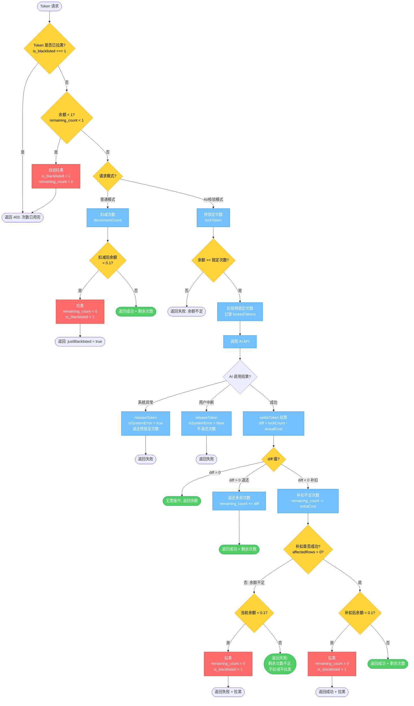

# Token 自动拉黑流程图

## 拉黑触发条件汇总

| 场景 | 触发条件 | 返回 |
|------|----------|------|
| checkTokenStatus | `is_blacklisted === 1` 或 `remaining_count < 1` | success: false, isBlacklisted: true |
| decrementCount 扣减后归零 | 扣减后 `finalCount < 0.1` | success: true, justBlacklisted: true |
| settleToken 补扣不足+归零 | 余额不足以补扣 且 `curCount < 0.1` | success: false, 拉黑 |
| settleToken 补扣成功后归零 | 补扣后 `afterCount < 0.1` | success: true, 拉黑 |

## 解封途径

- **福利领取**：`is_blacklisted === 1 && remaining_count < 0.1` 时，领取福利自动解封 + 加次数
- **每晚 0 点**：只重置 `remaining_count = 0`，**不解除黑名单**

## 补扣不足但不拉黑

- 余额 >= 0.1 但不足以补扣差额 → `success: false`，不扣减，不拉黑，保留原余额
